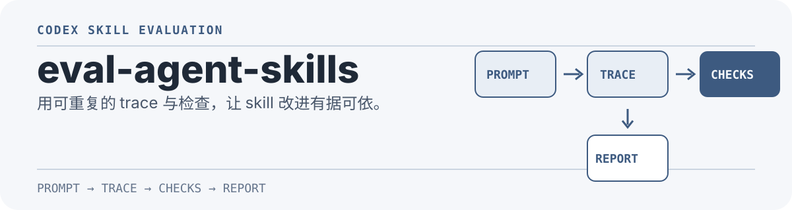

<p align="center">
  
</p>

<p align="center"><a href="./README.md">English</a></p>

# eval-agent-skills

为 Codex Agent Skills 建立可重复、可解释的评测闭环。用真实运行记录验证 skill 是否被正确触发、是否执行必要步骤，以及输出是否符合约定。

## What it is / 它是什么

这是一个可安装的 Codex skill，提供评测设计方法、可配置的 Node.js runner 与 JSONL trace 检查。它面向“测试 agent skill 的行为”，而不是替代应用本身的单元测试或端到端测试框架。

## 它解决什么问题

单次试跑“看起来没问题”并不能说明 skill 没有回归。`eval-agent-skills` 将评测拆为可观察的链路：提示词驱动 Codex 运行，保存 JSONL trace 与产物，再以确定性检查和可选的结构化 rubric 评分。

它可帮助你验证：

- skill 是否在显式、隐式请求中正确触发，并避免在相邻场景误触发；
- 是否执行必要命令、创建预期文件，或出现无意义的反复执行；
- 目录约定、代码风格等无法用简单文件检查表达的要求。

## 工作方式

```text
目标 skill + 测试提示集
          │
          ▼
codex exec --json（每个 case 独立工作区）
          │
          ▼
JSONL trace + 生成产物
          │
          ▼
命令 / 文件 / 触发 / 预算检查
          │
          ▼
report.json（可选：结构化 rubric）
```

## 快速开始

将 skill 放到 Codex 可发现的位置，例如仓库内的 `.codex/skills/`：

```sh
mkdir -p .codex/skills
cp -R skills/eval-agent-skills .codex/skills/
```

为目标 skill 写一组小而有针对性的 case：至少包含一个显式调用、一个应当隐式触发的真实请求，以及一个不应触发的相邻请求。配置字段和示例见 [eval-config.md](./skills/eval-agent-skills/references/eval-config.md)。

```sh
node skills/eval-agent-skills/scripts/run-evals.mjs ./evals/skill-evals.json
```

runner 会为每个 case 创建独立工作区，在 `outputDir/traces/` 保存 JSONL trace，并在 `outputDir/report.json` 写入汇总结果。请在一次性目录或干净 checkout 中运行：它会让 Codex 在 case 工作区中写入文件。

## 评测原则

1. **结果**：必要文件存在、构建或 smoke check 成功。
2. **过程**：触发正确 skill，并执行关键命令。
3. **风格**：仅在规则难以确定时加入只读 rubric 审核，并用 JSON Schema 固定输出结构。
4. **效率**：仅在确有循环或资源浪费风险时，限制命令数或 token 使用量。

每次真实故障都应成为新的 case。失败时先阅读 trace，再针对真正回归点收紧 skill 或 grader；不要降低检查标准来掩盖问题。

## 适用范围与限制

runner 会调用本机已安装并完成认证的 `codex` CLI；它不会自动提供模型访问权限。触发断言依赖你在真实 trace 中验证过的 `activationPatterns`，因为不同 Codex 版本的事件字段可能不同。需要写文件的 case 应始终在隔离工作区执行。

## 仓库结构

```text
skills/eval-agent-skills/
├── SKILL.md                  # 评测方法与使用边界
├── agents/openai.yaml        # Codex UI 元数据
├── scripts/run-evals.mjs     # JSONL trace 与确定性检查 runner
└── references/eval-config.md # 配置字段与示例
```

## 验证本仓库

```sh
python3 /Users/huangcn/.axon/repo/skills/.system/skill-creator/scripts/quick_validate.py skills/eval-agent-skills
node --check skills/eval-agent-skills/scripts/run-evals.mjs
```

## 参考

本项目的方法来自 OpenAI 的文章：[Testing Agent Skills Systematically with Evals](https://developers.openai.com/blog/eval-skills)。仓库内保留了可供[离线查阅的文章副本](./docs/Testing%20Agent%20Skills%20Systematically%20with%20Evals.md)。
